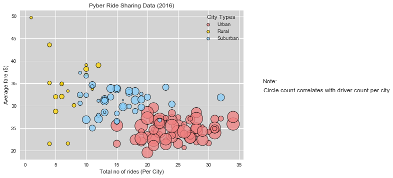
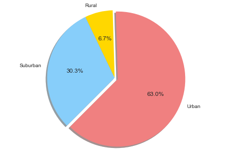
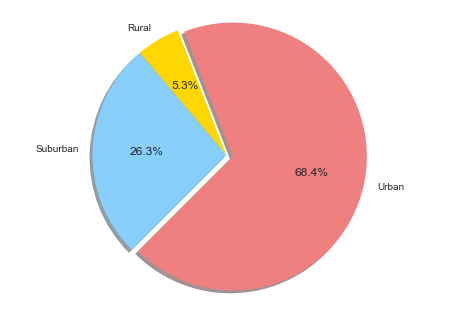
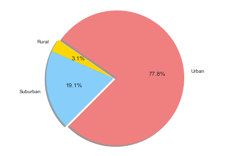

```python
#Dependencies
import csv
import numpy as np
import pandas as pd
import matplotlib.pyplot as plt
import seaborn as sns
```


```python
# Fetching the csv files and loading them in data frames
file_one = "/Users/gagankaur/Desktop/HW Assignments/MatPlotLib/city_data.csv"
city_df = pd.read_csv(file_one)
file_two = "/Users/gagankaur/Desktop/HW Assignments/MatPlotLib/ride_data.csv"
ride_df = pd.read_csv(file_two)
```


```python
# Merge the two file on the common column 'city'
merged = pd.merge(city_df, ride_df, on = ['city'])
```


```python
# Drop any duplicate rows that have been created during merging the two data frames
merged = merged.drop_duplicates(subset=['ride_id'])
```


```python
# Calculating the average fare and average number of rides per city
avg_fare = merged.groupby('city', as_index = False)['fare'].mean()
rides_per_city = merged.groupby('city', as_index = False)['ride_id'].count()
```


```python
# Creating different dataframes for three different city types

urban = merged.loc[merged['type']=='Urban']
rural = merged.loc[merged['type']=='Rural']
suburban = merged.loc[merged['type']=='Suburban']
```


```python


u_drivers = city_df[city_df['type']=='Urban']
r_drivers = city_df[city_df['type']=='Rural']
s_drivers = city_df[city_df['type']=='Suburban']

```


```python
# Calculating the average fare for cities in three different city types

avg_fare_urban = urban.groupby('city', as_index = False)['fare'].mean()
avg_fare_rural = rural.groupby('city', as_index = False)['fare'].mean()
avg_fare_suburban = suburban.groupby('city', as_index = False)['fare'].mean()
```


```python
# Calculating the total number of rides per city for three different city types

rides_per_ucity = urban.groupby('city', as_index = False)['ride_id'].count()
rides_per_rcity = rural.groupby('city', as_index = False)['ride_id'].count()
rides_per_scity = suburban.groupby('city', as_index = False)['ride_id'].count()
```


```python
# Creating three arrays for ride count and fare for all cities for each of the three city type

type1 = pd.merge(rides_per_ucity, avg_fare_urban, on = 'city')
type2 = pd.merge(rides_per_rcity, avg_fare_rural, on = 'city')
type3 = pd.merge(rides_per_scity, avg_fare_suburban, on = 'city')
type3 = type3[type3.ride_id <60] #eliminating the outlier

x1 = np.array(type1['ride_id'])
y1 = np.array(type1['fare'])

x2 = np.array(type2['ride_id'])
y2 = np.array(type2['fare'])

x3 = np.array(type3['ride_id'])
y3 = np.array(type3['fare'])

# t1 = (x1, y1)
# t2 = (x2, y2)
# t3 = (x3, y3)
```


```python
# Creating three arrays for the total number of driver counts for all cities in three city types

drv_cnt_urban = u_drivers['driver_count']
drv_cnt_rural = r_drivers['driver_count']
drv_cnt_suburban = s_drivers['driver_count']
#drv_cnt_urban
```


```python
#data = (t1, t2, t3)

# defining the aesthetics of the scatter plot

colors = ("lightcoral", "gold", "lightskyblue")
groups = ("Urban", "Rural", "Suburban") 
size = (drv_cnt_urban,drv_cnt_rural,drv_cnt_suburban)

# Create plot
fig = plt.figure()
ax = fig.add_subplot(1, 1, 1, facecolor="lightgrey")
plt.scatter(x1,y1, alpha = 0.75, c = colors[0], edgecolors = 'black', linewidths=1,
           s = size[0]*10, label = groups[0])
plt.scatter(x2,y2, alpha = 0.75, c = colors[1], edgecolors = 'black', linewidths=1,
           s = size[1]*10, label = groups[1])
plt.scatter(x3,y3, alpha = 0.75, c = colors[2], edgecolors = 'black', linewidths=1,
           s = size[2]*10, label = groups[2])
 

#Defining the labes of the plot    
plt.xlabel('Total no of rides (Per City)')
plt.ylabel('Average fare ($)')
plt.title('Pyber Ride Sharing Data (2016)')
txt1 = "Note:"
txt2 = "Circle count correlates with driver count per city"

# Defining the legend
lgnd = plt.legend(loc ='upper right', title = 'City Types')
lgnd.legendHandles[0]._sizes = [30]
lgnd.legendHandles[1]._sizes = [30]
lgnd.legendHandles[2]._sizes = [30]
plt.text(40, 35, txt1, ha='center')
plt.text(39, 33, txt2, ha='left')
plt.show()

```





```python
#Percent of total fares per city type

colors = ("lightcoral", "gold", "lightskyblue")
groups = ("Urban", "Rural", "Suburban")
```


```python
# Calculating the total fare of the rides for each cities
total_city_fare_urban = urban.groupby('city', as_index = False)['fare'].sum()
total_city_fare_rural = rural.groupby('city', as_index = False)['fare'].sum()
total_city_fare_suburban = suburban.groupby('city', as_index = False)['fare'].sum()

#Calculating the total fare for the three city type
total_fare_urban = total_city_fare_urban['fare'].sum()
total_fare_rural = total_city_fare_rural['fare'].sum()
total_fare_suburban = total_city_fare_suburban['fare'].sum()

#total fare of all city type
total_fare = total_fare_urban + total_fare_rural + total_fare_suburban

# Calculating the percent of fare for each city type
fare_percent_urban = (total_fare_urban/total_fare)*100
fare_percent_rural = (total_fare_rural/total_fare)*100
fare_percent_suburban = (total_fare_suburban/total_fare)*100

# Creating list for the percent fares
fare_percent = (fare_percent_urban, fare_percent_rural, fare_percent_suburban) 
```


```python
# Create the plot
explode=(0.05,0,0)
plt.pie(fare_percent, explode = explode, labels = groups, colors = colors,
       autopct = '%1.1f%%', shadow = True, startangle =225)
plt.axis('equal')
plt.show()
```





```python
#Percent of total rides per city type

# total number of rides for each city type
rides_count_urban = urban['ride_id'].count()
rides_count_rural = rural['ride_id'].count()
rides_count_suburban = suburban['ride_id'].count()

# total number of rides
total_rides_count = rides_count_urban + rides_count_rural + rides_count_suburban

# Calculate the percent of rides for each city type
rides_percent_urban = (rides_count_urban/total_rides_count)*100
rides_percent_rural = (rides_count_rural/total_rides_count)*100
rides_percent_suburban = (rides_count_suburban/total_rides_count)*100

#List for percent of rides
rides_percent = (rides_percent_urban, rides_percent_rural, rides_percent_suburban)


```


```python
# create the plot
explode=(0.05,0,0)
plt.pie(rides_percent, explode = explode, labels = groups, colors = colors,
       autopct = '%1.1f%%', shadow = True, startangle =225)
plt.axis('equal')
plt.show()
```





```python
#Percent of total drivers per city type
```


```python
#Toatl number of urban drivers
urban_city = city_df[city_df['type']=='Urban']
u_drv_cnt = urban_city['driver_count'].sum()

#Toatl number of rural drivers
rural_city = city_df[city_df['type']=='Rural']
r_drv_cnt = rural_city['driver_count'].sum()

#Toatl number of suburban drivers
suburban_city = city_df[city_df['type']=='Suburban']
s_drv_cnt = suburban_city['driver_count'].sum()

# Total number of drivers 
total_drivers = (u_drv_cnt + r_drv_cnt + s_drv_cnt)

# Calculating the drivers percent per city type
u_drv_pcnt = (u_drv_cnt/total_drivers)*100
r_drv_pcnt = (r_drv_cnt/total_drivers)*100
s_drv_pcnt = (s_drv_cnt/total_drivers)*100

#creating list for array percent
drivers_percent = (u_drv_pcnt, r_drv_pcnt, s_drv_pcnt)

```


```python
#Create the plot
explode=(0.05,0,0)
plt.pie(drivers_percent, explode = explode, labels = groups, colors = colors,
       autopct = '%1.1f%%', shadow = True, startangle =225)
plt.axis('equal')
plt.show()
```





```python

```
